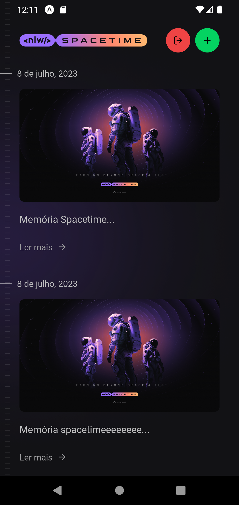
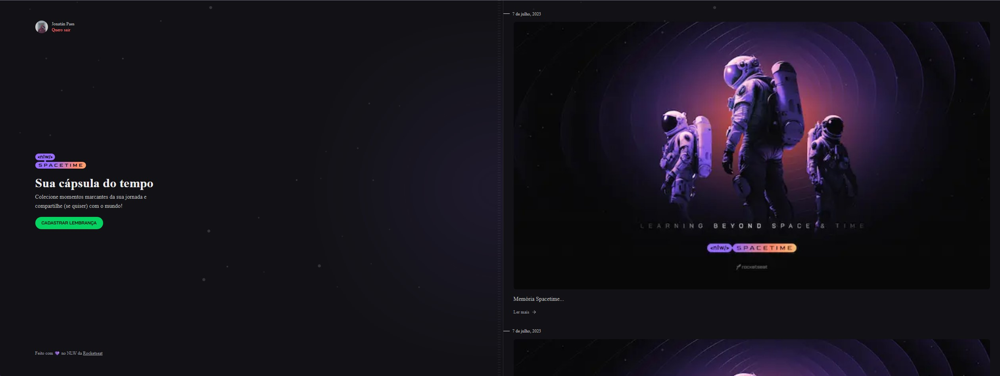

<h1 align="center">
   NLW Spacetime - Cápsula do Tempo
</h1>

<p align="center">
  O projeto Spacetime cria publicação de memórias, que permite que o usuário realize o carregamento de imagens, forneça uma descrição e associe uma data a uma nova entrada de memória que será criada. <br />
  A implementação do projeto envolve a integração com uma API localizada na pasta Server, que possibilita a autenticação com o Github, além de fornecer funcionalidades para listar, criar, editar e excluir memórias.
</p>

<p align="center">
  <a href="#information_source-como-executar">ℹ️ Como Executar?</a>&nbsp;&nbsp;&nbsp;|&nbsp;&nbsp;&nbsp;
  <a href="#backend">🏧 Back-end</a>&nbsp;&nbsp;&nbsp;|&nbsp;&nbsp;&nbsp;
  <a href="#mobile">📱 Mobile</a>&nbsp;&nbsp;&nbsp;|&nbsp;&nbsp;&nbsp;
  <a href="#web">💻 Web</a>&nbsp;&nbsp;&nbsp;|&nbsp;&nbsp;&nbsp;
  <a href="#tecnologias">🚀 Tecnologias</a>&nbsp;&nbsp;&nbsp;
</p>


---

# :information_source: Como Executar?

> Clone o Repositório:

```bash
Node version 18.16.0
git clone https://github.com/JonatanPaes/spacetime.git
cd spacetime
npm install
```

# :backend: Back-end
O back-end desse projeto é construído em Node.js

```sh
cd server

# Copiar o arquivo com os dados de conexão e demais variáveis ambiente
cp .env.example .env

# Rodar as migrations do prisma
npx prisma migrate dev

# Subir o servidor HTTP
npm run dev
```


# :mobile: Mobile

Para executar o app mobile do Spacetime precisa estar com serve executando. Utilizamos o Expo, uma ferramenta incrível da comunidade React Native. Além do Expo, é necessário que você utilize algum emulador local ou um dispositivo físico pra visualizar a aplicação.

Após configurar o ambiente mobile, você pode abrir o emulador e executar o projeto de acordo com a plataforma que estiver utilizando:

<p align="center">
   
</p>

```sh
cd mobile

# Configuração para executar local
No arquivo src > lib > api.ts na baseURL colocar ip local

# Caso esteja usando Android
npm run android

# Caso esteja usando iOS
npm run ios

# Caso esteja usando um dispositivo físico
npm run start
```

# :web: Web
Para executar Web precisa estar com serve executando.

<p align="center">
  
</p>

```sh
cd web

# Copiar o arquivo com os dados de conexão e demais variáveis ambiente
cp .env.example .env.local

# Configuração para executar local
No arquivo next.config.js em domains pode ser que tenha que colocar ip local

# Executar wev
npm run dev
```

# :tecnologias: Tecnologias

**🏧 Server:**

- [Prisma](https://github.com/prisma/prisma)
- [TypeScript](https://github.com/microsoft/TypeScript)
- [Axios](https://axios-http.com/ptbr/docs/intro)
- [Fastify](https://www.fastify.io/)
- [Zod](https://zod.dev/)


**📱 Mobile:**

- [Expo](https://github.com/expo/expo)
- [TypeScript](https://github.com/microsoft/TypeScript)
- [NativeWind](https://github.com/marklawlor/nativewind) _(Tailwind para o React Native)_
- [DayJS](https://day.js.org/)
- [Axios](https://axios-http.com/ptbr/docs/intro)


**💻 Web:**

- [NextJS](https://nextjs.org/)
- [TailwindCSS](https://tailwindcss.com/)
- [DayJS](https://day.js.org/)
- [JS Cookie](https://github.com/js-cookie/js-cookie)
- [TypeScript](https://github.com/microsoft/TypeScript)
- [Axios](https://axios-http.com/ptbr/docs/intro)